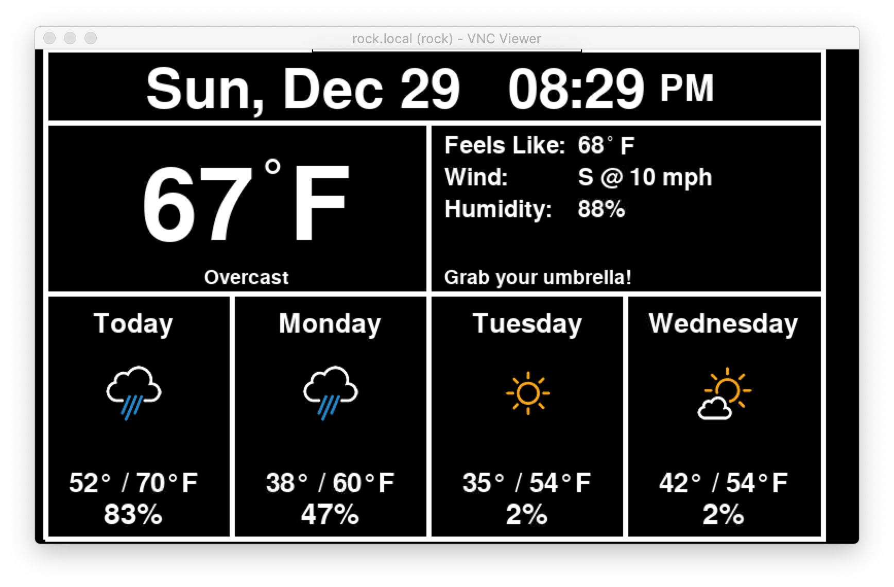
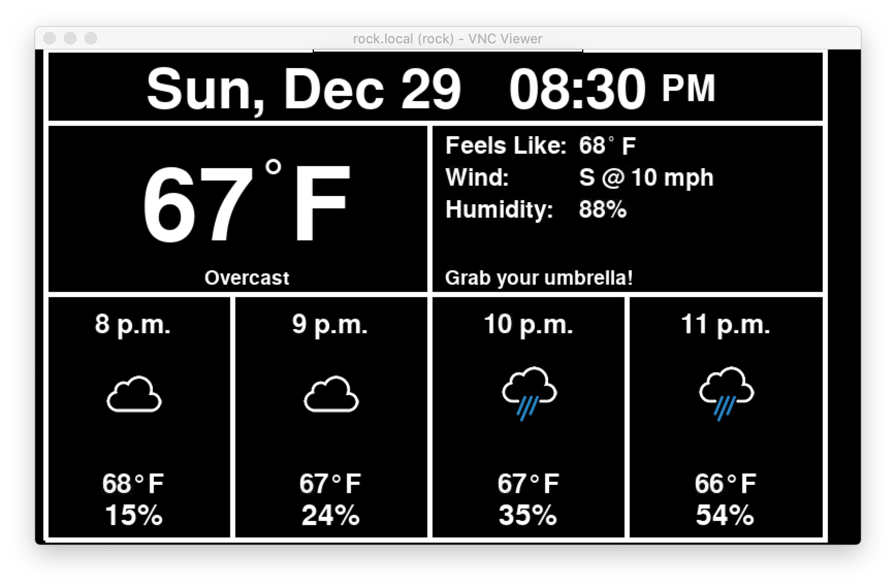
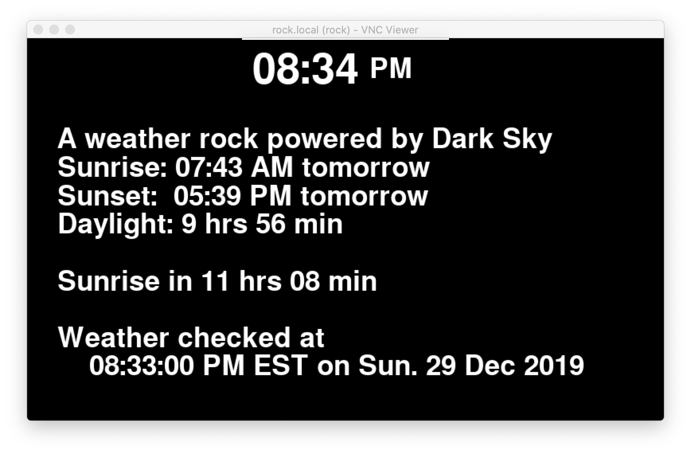
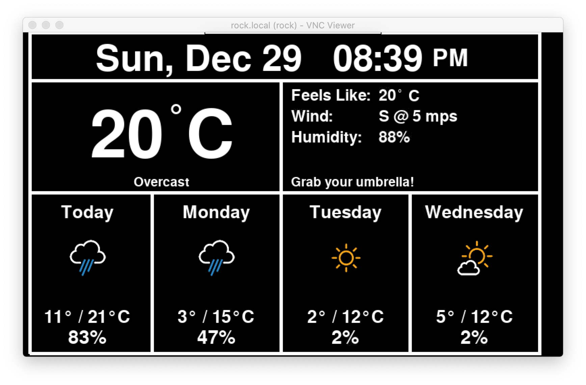
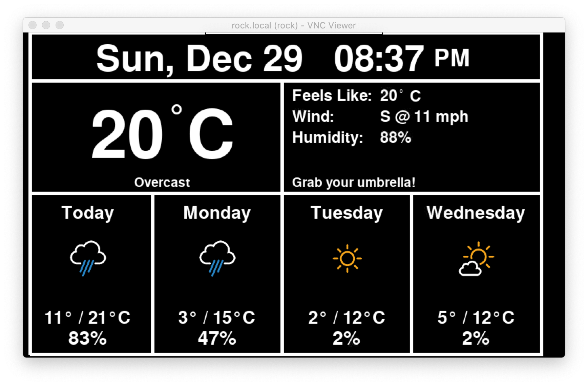
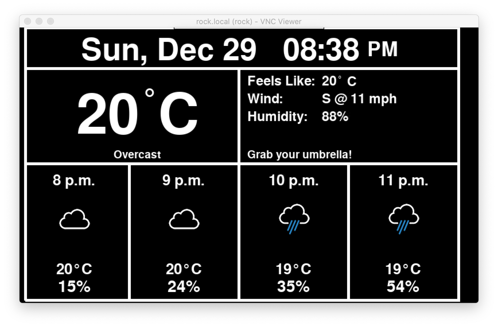

# PiWeatherRock - Displays local weather on a Raspberry Pi (or a TV)

[](https://gitter.im/PiWeatherRock/community?utm_source=badge&utm_medium=badge&utm_campaign=pr-badge)

| Daily forecast                                         | Hourly forecast                                          | Info screen                                 |
|--------------------------------------------------------|----------------------------------------------------------|---------------------------------------------|
|  |  |  |

- [Introduction](#introduction)
- [Installation](#installation)
  - [Optional Steps](#optional-steps)
- [Updates](#updates)
- [Usage](#usage)
- [Non-US units](#non-us-units)
- [Troubleshooting](#troubleshooting)
  - [Git permission denied](#git-permission-denied)
  - [Starting fresh](#starting-fresh)
- [Support](#support)
  - [Chat](#chat)
  - [GitHub Issues](#github-issues)
- [Influence and Credit](#influence-and-credit)
  - [Weather.py - A PyGame-based weather data/forecast display](#weatherpy---a-pygame-based-weather-dataforecast-display)
  - [Icons](#icons)
  - [GPIOmock.py](#gpiomockpy)

## Introduction

PiWeatherRock is an internet-connected weather station. Its purpose is to display local weather conditions. It was created with the goal of having a simple way to check the weather before taking our dogs out for a walk. The end result is a modern version of a weather rock.

Right now all data is pulled from Dark Sky. A future iteration will also incorporate data from sensors connected to a battery powered Arduino.

## Installation

> This is based on the assumption that you are using Raspbian 10 (buster). Though the code works on other platforms, the setup process has been tailored for this operating system.

Before continuing, run `sudo raspi-config` and select `Boot Options` > `Desktop / CLI` > `Desktop Autologin`. Reboot if prompted.

After that, clone this repository to your to your home directory:

```bash
git clone https://github.com/genebean/PiWeatherRock.git /home/pi/PiWeatherRock
```

Once you have cloned the repository, `cd` into it and create your initial config file:

```bash
cd /home/pi/PiWeatherRock
cp config.py.sample config.py
```

The next thing you need to do is go to https://darksky.net/dev and get an API key. You can make up to 1,000 API calls per day without paying, or even providing payment info.

In addition to your API key, you will also need your latitude and longitude. https://gps-coordinates.org/ seems to work well for this but I prefer to use the compass app on my iPhone.

After getting a key and your location information, edit `config.py` and adjust the values based on your preferences.

With the config file edited you are ready to run the install script by providing it with the name you'd like your Pi to have. For example, to name your Pi `mylittlepi` you'd do this:

```bash
sudo ./install.sh mylittlepi
```

This will execute the [install.sh](install.sh) from this repository which will do some initial prep work and then use Puppet to configure everything else by applying [setup.pp](setup.pp).

When this finishes you will have a new systemd service named [PiWeatherRock.service](PiWeatherRock.service) that automatically starts up. You can check the status of the service by running `sudo systemctl status PiWeatherRock`.

### Optional Steps

[setup.pp](setup.pp) contains some extra info that is commented out if you are not using the stock GUI.

Running the command below will tell puppet to keep things in line every 30 minutes. See https://crontab.guru/ for examples of how you could adjust the interval.

```bash
puppet resource cron 'run puppet' \
ensure=present \
command='/usr/bin/sudo /usr/bin/puppet apply /home/pi/PiWeatherRock/setup.pp' \
minute='*/30'
```

## Updates

If you already have this project cloned to your computer or Pi then just run these commands:

```bash
pi@rock:~/PiWeatherRock $ git pull
# you should see some output from git here if there are any updates

pi@rock:~/PiWeatherRock $ sudo puppet apply setup.pp
# below is a sample of the type of output you may see
Notice: Compiled catalog for rock in environment production in 0.81 seconds
Notice: /Stage[main]/Main/Python::Pip[darkskylib]/Exec[pip_install_darkskylib]/returns: executed successfully
Notice: /Stage[main]/Main/Service[PiWeatherRock.service]: Triggered 'refresh' from 1 event
Notice: Applied catalog in 115.65 seconds
```

## Usage

While the service is running there are some keyboard shortcuts to see additional information. These can be used from a keyboard plugged into the Pi or via VNC. VNC is available via IP or the name you set earlier (ex: `mylittlepi` is available via `mylittlepi.local`).

- __d__: Displays the daily weather screen
- __h__: Displays the hourly weather screen
- __i__: Displays an info screen which contains some additional info information
- __q__: Quits the program

## Non-US units

Dark Sky supports four sets of units for forecasts: `ca`, `si`, `uk2`, and `us`. The screenshots at the top of this page are with the units set to `us` in the config file. Below are screenshots of the other three:

| Units | Daily forecast                                          | Hourly forecast                                           |
|-------|---------------------------------------------------------|-----------------------------------------------------------|
| CA    |   |   |
| SI    |   |   |
| UK2   |  |  |

## Troubleshooting

Below are a couple of tips based on issues I’ve either run into myself or others have reported. Suggestions for Addison’s are welcome.

### Git permission denied 

If the `git` command says `error: cannot open .git/FETCH_HEAD: Permission denied` run this to fix things and then rerun whatever you were trying to do before seeing the error:

```bash
sudo chown -R pi:pi /home/pi/PiWeatherRock
```

### Starting fresh

If you’d like to start fresh I suggest backing up your `config.py` and then running the following commands:

```bash
cd /home/pi
sudo rm -rf /home/pi/PiWeatherRock
```

After that you can start over using the installation instructions above. 

## Support

### Chat

Want to chat with other PiWeatherRock users? We have a Gitter Room which you can join at [gitter.im/PiWeatherRock/community](https://gitter.im/PiWeatherRock/community).

### GitHub Issues

I try to keep an eye on the issues in the repo. Feel free to file a bug report of a feature request.

## Influence and Credit

### Weather.py - A PyGame-based weather data/forecast display

- The bulk of this project originated with the code written by Jim Kemp and published at http://www.instructables.com/id/Raspberry-Pi-Internet-Weather-Station/.
- Jim Kemp's version pulled from weather.com via pywapi but that doesn't seem seem to work any longer. This project now pulls from Weather Underground.
- Some ideas were also taken from https://github.com/sarnold/pitft-weather-display.

### Icons

Almost all the icons have been replaced with ones from [github.com/manifestinteractive/weather-underground-icons](https://github.com/manifestinteractive/weather-underground-icons/tree/47aca0a69c1246d80ee1b915c4f9906adbaa1e1b).

Some additional icons come from [erikflowers.github.io/weather-icons](https://erikflowers.github.io/weather-icons/). These have been converted to png files via the `icons/alt_icons/generate-dark-sky-pngs.sh` script in this repository. To use the script you will need to first run `pip3 install cairosvg`.

### GPIOmock.py

Pulled GPIOmock.py from [github.com/grantwinney/52-Weeks-of-Pi](https://github.com/grantwinney/52-Weeks-of-Pi/blob/b4df240bfb224b1c027c9adf71cac8159286aade/GPIOmock.py) to enable testing in an x86 virtual machine.
