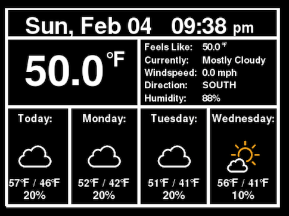
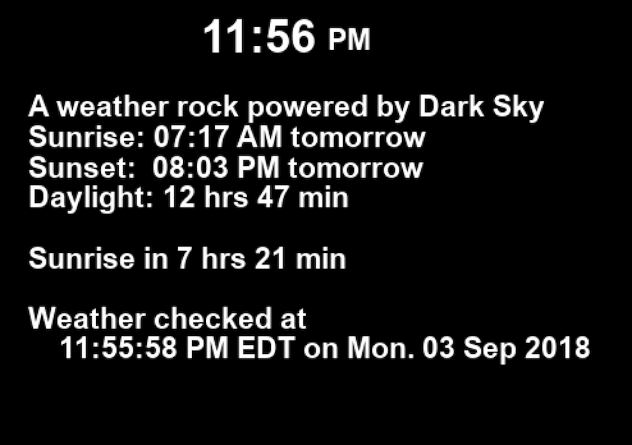

# PiWeatherRock - Displays local weather on a Raspberry Pi

_Designed with a 3.5" 480x320 TFT display in mind_


| Main screen                                                  | Info screen                                            |
| ------------------------------------------------------------ | ------------------------------------------------------ |
|  |  |

## Introduction

PiWeatherRock is an internet-connected weather station. Its purpose is to
display local weather condtions. It was created with the goal of having a
simple way to check the weather before taking our dogs out for a walk. The end
result is a modern version of a weather rock.

Right now all data is pulled from Dark Sky. A future interation
will also incorporate data from sensors connected to a battery powered Arduino.

_Note:_ A previous version pulled data from Weather Underground. IBM bought
Weather Undergrund and decided they were too cool to continue to let
developers use their api at all for free. To quote their site as of
2018-09-03:

>To improve our services and enhance our relationship with our users, we will no longer provide free weather API keys as part of our program.

I cannot wrap my head around how this is supposed to "enhance our relationship
with our users."


## Usage

The first thing you need to do to run this applicaiton is go to
https://darksky.net/dev and get an API key. You can make up to 1,000 API calls
per day without paying or even providing payment info. After getting a key,
copy `config.py.sample` to `config.py` and fill in values for your setup. In
addition to your API key you will also need your latitude and longitude.
https://gps-coordinates.org/ seems to work well for this as do some cell phone
apps.

Once you have your config file in place, you will need to install dependencies.

_Note:_ Anywhere you see `pip` or `python` you should be able to substitute the
Python 3 versions without issue (aka `pip3` and `python3`).

```bash
sudo apt-get install libsdl1.2-dev libsdl-ttf2.0-dev libsdl-image1.2-dev \
libsdl-mixer1.2-dev libjpeg-dev libportmidi-dev libtimedate-perl
pip install -r requirements.txt
```

Now you should be able to run `python weather.py` to start the program. While
its running there are some keyboard shortcuts to see additional information:

* __w__: Displays the main weather screen
* __i__: Displays an info screen which contains some additiional info
  information
* __q__: Quits the program

## Influence and Credit

### Weather.py - A PyGame-based weather data/forecast display

* The buld of this project originated with the code written by Jim Kemp and
  published at
  http://www.instructables.com/id/Raspberry-Pi-Internet-Weather-Station/.
* Jim Kemp's version pulled from weather.com via pywapi but that doesn't seem
  seem to work any longer. This project now pulls from Weather Underground.
* Some ideas were also taken from
  https://github.com/sarnold/pitft-weather-display.

### Icons

Almost all the icons have been replaced with ones from
[github.com/manifestinteractive/weather-underground-icons](https://github.com/manifestinteractive/weather-underground-icons/tree/47aca0a69c1246d80ee1b915c4f9906adbaa1e1b).

Some additional icons come from
[erikflowers.github.io/weather-icons](https://erikflowers.github.io/weather-icons/).
These have been converted to png files via the
`icons/alt_icons/generate-dark-sky-pngs.sh` script in this repository. To use
the script you will need to first run `pip3 install cairosvg`.

### GPIOmock.py

Pulled GPIOmock.py from
[github.com/grantwinney/52-Weeks-of-Pi](https://github.com/grantwinney/52-Weeks-of-Pi/blob/b4df240bfb224b1c027c9adf71cac8159286aade/GPIOmock.py)
to enable testing in an x86 virtual machine.
